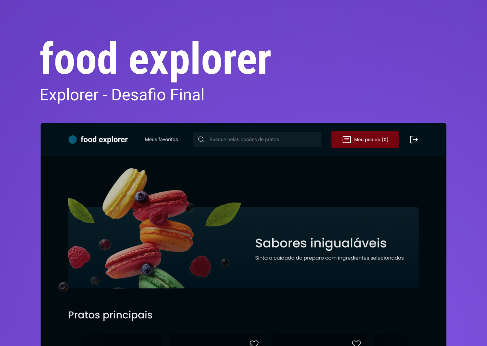

# 🍕 Food Explorer - FrontEnd

Esta é uma aplicação de um estabelecimento fictício. Nela você pode, como administrador, fazer uma listagem das suas refeições, podendo criar pratos, editar, excluir e, com o login de usuário, listar/pesquisar pelos pratos existentes criados pelo administrador.

Agora com **infraestrutura como código** usando **Terraform** e **Kubernetes**!

<div align="center">
    
</div>

## Sumário

- [Aviso](#aviso)
- [Sobre](#sobre)
- [Tecnologias](#tecnologias)
- [Funcionalidades](#funcionalidades)
- [Como rodar localmente](#como-rodar-localmente)
- [Utilização manual (método antigo)](#utilização-manual-método-antigo)
- [Autor](#nerd_face-autor)

</br>

## 🚨 Aviso

- **USUÁRIO ADM**:
  - Email: henrique@gmail.com
  - Senha: 123456

- É possível testar a aplicação por meio deste link: [clicando aqui!](https://foods-explorer.netlify.app)

- Embora o projeto tenha sido concluído, poderá haver aprimoramentos no futuro.

- **NOVO**: Agora você pode rodar toda a aplicação (frontend + backend) localmente usando Kubernetes e Terraform!

</br>

## 📖 Sobre

Este é o projeto final do programa Explorer da Rocketseat, que consistiu em desenvolver uma aplicação para gerenciar pedidos de um restaurante. A aplicação conta com três tipos de usuários:

- O usuário padrão que pode acessar a página inicial, buscar pratos por nome ou ingrediente, e ver informações detalhadas sobre os pratos.

- O usuário administrador que tem os mesmos privilégios do usuário padrão, além de poder cadastrar pratos, editar informações sobre os pratos e excluir pratos.

**Evoluções técnicas:**
- Containerização com Docker
- Orquestração com Kubernetes (Kind)
- Infraestrutura como código com Terraform
- Deploy automatizado

</br>

## 🛠️ Tecnologias

### Frontend
- **ReactJS** - Biblioteca para interfaces
- **Vite** - Build tool e dev server
- **Styled Components** - Estilização
- **Axios** - Requisições HTTP
- **JavaScript** - Lógica da aplicação

### Backend
- **Node.js** - Runtime
- **Express** - Framework web
- **SQLite** - Banco de dados
- **Knex** - Query builder

### DevOps & Infraestrutura
- **Docker** - Containerização
- **Kubernetes (Kind)** - Orquestração
- **Terraform** - Infrastructure as Code
- **Git** - Controle de versão

</br>

## ✨ Funcionalidades

- [x] Mostrar todos pratos
- [x] Mostrar um prato específico
- [x] Fazer a busca de um prato pelo nome
- [x] Criar conta
- [x] Fazer login
- [x] Cadastrar um prato
- [x] Editar um prato
- [x] **NOVO**: Deploy automatizado com Terraform
- [x] **NOVO**: Migrations automáticas do banco
- [x] **NOVO**: Health checks e monitoramento

</br>

## 🚀 Como rodar localmente

### Pré-requisitos

- [Docker](https://docs.docker.com/get-docker/)
- [Kind](https://kind.sigs.k8s.io/docs/user/quick-start/#installation)
- [kubectl](https://kubernetes.io/docs/tasks/tools/)
- [Terraform](https://developer.hashicorp.com/terraform/downloads)

### Método rápido (recomendado)

1. **Clone os repositórios**
   ```bash
   git clone https://github.com/kinhoreis2000/Front-Foods-Explorer
   git clone https://github.com/kinhoreis2000/BACK-END-FOODS-EXPLORER
   ```

2. **Crie o cluster Kubernetes**
   ```bash
   cd Front-Foods-Explorer
   kind create cluster --config kind-config.yaml
   ```

3. **Build das imagens Docker**
   ```bash
   # Backend
   cd ../BACK-END-FOODS-EXPLORER
   docker build -t backend-foodexplorer-image:latest .
   
   # Frontend
   cd ../Front-Foods-Explorer
   docker build -t frontend-foodexplorer-image:latest --build-arg VITE_API_URL=http://localhost:5000 .
   ```

4. **Carregar imagens no Kind**
   ```bash
   kind load docker-image backend-foodexplorer-image:latest --name food-cluster
   kind load docker-image frontend-foodexplorer-image:latest --name food-cluster
   ```

5. **Deploy com Terraform**
   ```bash
   cd terraform
   terraform init
   terraform apply
   ```

6. **Acessar a aplicação**
   - **Frontend**: http://localhost:3000
   - **Backend**: http://localhost:5000

### Comandos úteis

```bash
# Ver status dos pods
kubectl get pods

# Ver logs do backend
kubectl logs deployment/backend

# Ver logs do frontend
kubectl logs deployment/frontend

# Destruir tudo
terraform destroy
kind delete cluster --name food-cluster
```

</br>

## 🔧 Utilização manual (método antigo)

- Antes de utilizar o projeto localmente pelo método manual, será necessário seguir a documentação para instalar o backend. [Clique aqui para instalar o backend](https://github.com/kinhoreis2000/BACK-END-FOODS-EXPLORER).

- Clone o repositório do projeto em sua máquina usando o seguinte comando:

```bash
git clone https://github.com/kinhoreis2000/Front-Foods-Explorer
```

- Em seguida, instale as dependências necessárias para o projeto:

```bash
npm install
```

- Para iniciar um servidor local para o frontend, use o seguinte comando:

```bash
npm run dev
```

- Após executar o comando acima, você deverá receber uma mensagem semelhante a esta:

```bash
VITE v3.0.9  ready in 1989 ms

➜  Local:   http://127.0.0.1:3220/
➜  Network: use --host to expose
```

- Finalmente, abra o navegador em seu endereço local informado na mensagem anterior, na seção "Local", para testar a aplicação.

</br>

## 📁 Estrutura do projeto

```
Front-Foods-Explorer/
├── terraform/              # 🆕 Infraestrutura como código
│   ├── backend.tf           # Configuração do backend
│   ├── frontend.tf          # Configuração do frontend
│   ├── database.tf          # Jobs de migração
│   ├── variables.tf         # Variáveis
│   └── terraform.tfvars     # Valores das variáveis
├── k8s/                     # Arquivos YAML do Kubernetes
├── src/                     # Código fonte do React
├── kind-config.yaml         # 🆕 Configuração do cluster Kind
├── Dockerfile               # 🆕 Containerização
└── README.md               # Este arquivo
```

</br>

## 🤝 Como contribuir

1. Fork o projeto
2. Crie uma branch para sua feature (`git checkout -b feature/nova-feature`)
3. Commit suas mudanças (`git commit -m 'Adiciona nova feature'`)
4. Push para a branch (`git push origin feature/nova-feature`)
5. Abra um Pull Request

</br>

---

## 🤓 Autor

De autoria do desenvolvedor **Luiz Henrique Reis**. 

[](https://www.linkedin.com/in/luiz-henrique-reis-do-nascimento-8624b9161/)
[](mailto:kinhoreis2000@gmail.com)

</br>

_Caso encontre algum problema com o funcionamento de algum recurso, consulte esta documentação e tente novamente._

_Caso erros persistam, por favor, entre em contato com [kinhoreis2000@gmail.com](mailto:kinhoreis2000@gmail.com)._

---

⭐ Se este projeto te ajudou, deixe uma estrela no repositório!